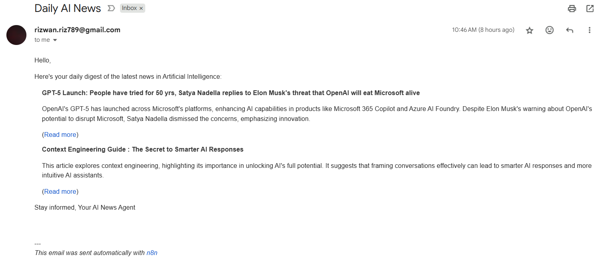

# Daily AI News Agent (n8n + Gemini)  

> *"AI agents will become our digital assistants, helping us navigate the complexities of the modern world. They will make our lives easier and more efficient."* – Jeff Bezos  

## What is an AI Agent?  
An **AI agent** is a computer program or system that:  
- Perceives its environment  
- Reasons about what it perceives  
- Takes actions to achieve specific goals  

In short: it’s a **thinking–doing machine**.  

---

## How It Works  
This AI agent was built using **n8n**, a no-code workflow automation tool.  
Every morning, the **AI Tech News Agent**:  
1. Fetches the latest AI tech news using [NewsAPI](https://newsapi.org)  
2. Sends the articles to **Gemini 2.5 Flash** (LLM) for summarization and formatting  
3. Generates a neat, readable daily digest  
4. Uses Gmail to send the digest directly to my inbox  

---

## Learning Notes  

**Resource used:** [YouTube – Build AI Agents with n8n](https://www.youtube.com/watch?v=EH5jx5qPabU&t=731s)  

**Key learnings:**  
- What is an Agent?  
- Difference between **Agents** and **Automations**  
- **3 Main Components:**  
  1. **Brain** – Large Language Model (LLM)  
  2. **Tools** – APIs, connectors, etc.  
  3. **Memory** – Context storage  
- Types of systems: Single-agent vs. Multi-agent  
- Guardrails: Purpose and importance

---

## Screenshots  

### Workflow in n8n  
  

### Example Email  
  

---
